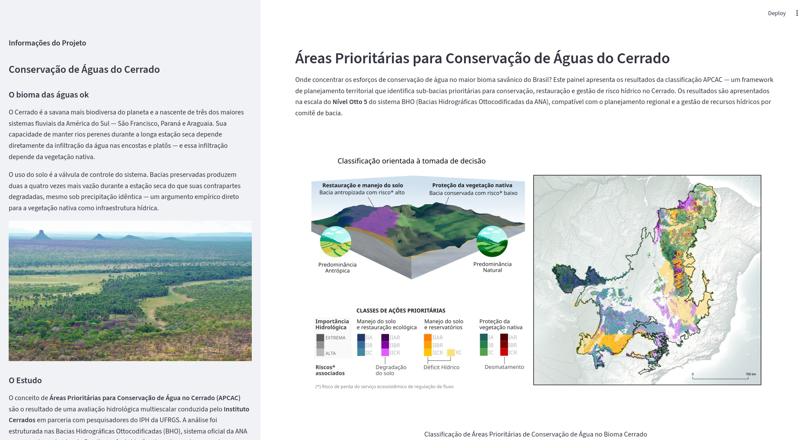
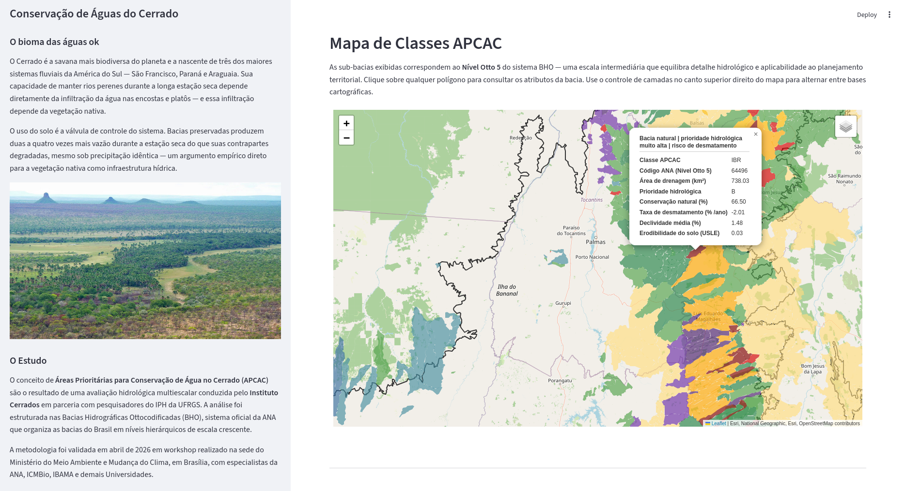
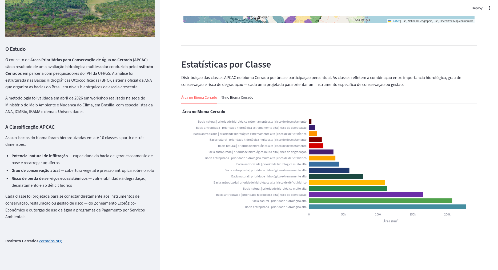

# Visualizador APCAC — Cerrado

Painel interativo em Streamlit que apresenta as **Áreas Prioritárias para Conservação de Águas do Cerrado (APCAC)**, produzidas pelo Instituto Cerrados. O sistema é totalmente configurável via um arquivo JSON — nenhum código precisa ser alterado para adaptar conteúdo, dados ou estilos.

---

## Demonstração
 
**Visão geral** — painel completo com barra lateral, imagem de introdução e mapa interativo.
 

 
**Consulta por clique** — ao clicar em qualquer sub-bacia, um popup exibe o nome da classe e os atributos configurados em `specs.json`.
 

 
**Estatísticas** — distribuição das classes APCAC por área e participação percentual no bioma, em gráficos de barras interativos.
 



---

## Estrutura do Repositório

```
.
├── mapview.py     # Módulo principal da aplicação — não editar
├── specs.json     # Configuração completa do painel — editar aqui
├── info.md        # Texto da barra lateral (markdown)
└── stats.csv      # Estatísticas por classe (CSV, separador ";")
```

Os arquivos geoespaciais (`map_main`, `map_roi`) podem ser arquivos locais na mesma pasta ou URLs externas — ambos são suportados. No projeto APCAC, esses arquivos são servidos via Cloudflare R2 e referenciados por URL em `specs.json`.

> **`specs.json` é o único arquivo que precisa ser editado** para adaptar o painel a um novo projeto. O arquivo incluído no repositório é o exemplo canônico do projeto APCAC — estrutura, chaves e valores servem de referência direta para qualquer implantação futura com dados diferentes.

### O que fica no repositório vs. o que fica na nuvem

| Arquivo | Onde vive | Motivo |
|---|---|---|
| `mapview.py`, `specs.json`, `info.md`, `stats.csv` | Repositório Git | Pequenos, versionáveis, necessários para o app iniciar |
| `map_main.geojson`, `map_roi.geojson` | Cloudflare R2 | Arquivos grandes servidos via URL pública |

Quando o app é implantado no Streamlit Community Cloud, ele clona o repositório e busca os arquivos geoespaciais diretamente das URLs configuradas em `specs.json` — o comportamento é idêntico ao da execução local.

---

## Pré-requisitos

- Python **3.10 ou superior**
- Recomendado: um ambiente virtual (`venv`, `conda` ou `mamba`)

---

## Instalação

### Opção A — pip + venv

```bash
python3 -m venv .venv
source .venv/bin/activate        # Windows: .venv\Scripts\activate
pip install --upgrade pip
pip install streamlit folium geopandas pandas plotly requests
```

### Opção B — conda / mamba (recomendado em Windows e macOS)

```bash
conda create -n apcac python=3.11
conda activate apcac
conda install -c conda-forge geopandas streamlit folium plotly
pip install requests
```

---

## Execução

```bash
streamlit run mapview.py
```

O Streamlit exibirá uma URL local (ex.: `http://localhost:8501`). Abra no navegador para explorar o mapa e os gráficos.

> O mapa é gerado e cacheado na primeira carga. Recarregamentos subsequentes são instantâneos enquanto a sessão estiver ativa.

---

## Configuração — `specs.json`

Todo o conteúdo do painel é controlado por `specs.json`. O arquivo incluído no repositório é o exemplo canônico do projeto APCAC e serve de referência para qualquer adaptação futura.

### Títulos e textos

| Chave | Descrição |
|---|---|
| `title_page` | Título da aba do navegador |
| `page_icon` | Emoji exibido na aba do navegador |
| `title_intro` | Título da seção de introdução |
| `desc_intro` | Parágrafo descritivo abaixo do título de introdução (`null` para omitir) |
| `title_map` | Título da seção do mapa |
| `desc_map` | Parágrafo descritivo abaixo do título do mapa (`null` para omitir) |
| `title_stats` | Título da seção de estatísticas |
| `desc_stats` | Parágrafo descritivo abaixo do título de estatísticas (`null` para omitir) |
| `title_info` | Título da barra lateral |

### Arquivos de dados

| Chave | Descrição |
|---|---|
| `info` | Caminho para o arquivo Markdown da barra lateral |
| `image` | Caminho local ou URL da imagem de introdução |
| `image_height` | Altura fixa da imagem em pixels (`null` para largura total) |
| `image_caption` | Legenda exibida abaixo da imagem (`null` para omitir) |
| `stats` | Caminho para o CSV de estatísticas (separador `;`) |
| `map_main` | Caminho para o GeoJSON da camada principal classificada |
| `map_roi` | Caminho para o GeoJSON do contorno da Região de Interesse (opcional) |

> Caminhos relativos são resolvidos a partir da pasta onde `mapview.py` está localizado. URLs `https://` também são aceitas.

### Mapas base

Lista de camadas de tiles exibidas no controle de camadas do mapa. A primeira da lista é exibida por padrão.

```json
"basemaps": [
  {
    "name": "National Geographic",
    "url": "https://server.arcgisonline.com/.../tile/{z}/{y}/{x}",
    "attribution": "Esri, National Geographic"
  }
]
```

### Colunas do mapa

Define quais atributos do GeoJSON aparecem no popup ao clicar em uma feição, e com qual rótulo.

```json
"columns": {
  "cd_apcac":   "Classe APCAC",
  "nuareacont": "Área de drenagem (km²)"
}
```

Colunas ausentes no GeoJSON são silenciosamente ignoradas.

### Estatísticas

| Chave | Descrição |
|---|---|
| `classes` | Nome da coluna do GeoJSON que identifica a classe de cada feição |
| `stats_classes_column` | Nome da coluna no CSV que identifica a classe (geralmente a mesma) |
| `stats_charts` | Lista de gráficos a exibir — um por aba |

Cada entrada de `stats_charts`:

```json
{
  "column":  "area_km2",
  "label":   "Área no Bioma Cerrado",
  "x_label": "Área (km²)"
}
```

### Estilos das classes

Cada classe presente na coluna `classes` deve ter uma entrada em `style_classes`:

```json
"style_classes": {
  "IAR": {
    "color": "85,0,0,255",
    "name":  "Bacia natural | prioridade extremamente alta | risco de desmatamento"
  }
}
```

- `color`: RGBA no formato `"R,G,B,A"` (valores 0–255), mesmo padrão do QGIS.
- `name`: texto exibido no cabeçalho do popup e no eixo dos gráficos de estatísticas.
- Classes presentes nos dados mas ausentes em `style_classes` são renderizadas em cinza (`#808080`) sem interromper a aplicação.

> ⚠️ **Limitação do Folium — apenas cores sólidas são suportadas.**
> O Folium renderiza os polígonos via Leaflet.js no navegador, que aceita exclusivamente preenchimento sólido (`fillColor`). Padrões de hachura, texturas ou preenchimentos compostos — como os disponíveis no QGIS — não são tecnicamente possíveis neste ambiente. Qualquer distinção visual entre classes deve ser feita exclusivamente por cor.

### Estilo da ROI

Camada de contorno da Região de Interesse — renderizada apenas com borda, sem preenchimento.

```json
"style_roi": {
  "color":  "50,50,50,255",
  "weight": 2,
  "name":   "Região de Interesse (Bioma Cerrado)"
}
```

### Imagem de introdução

A imagem exibida na seção de introdução do painel é configurada por três chaves em `specs.json`:

```json
"image":         "https://exemplo.com/imagem.jpg",
"image_height":  400,
"image_caption": null
```

- `image`: caminho local ou URL pública da imagem. Formatos suportados: PNG, JPG, JPEG, GIF, WebP.
- `image_height`: altura fixa em pixels, com largura proporcional automática. Defina `null` para ocupar a largura total do painel.
- `image_caption`: legenda exibida centralizada abaixo da imagem. Defina `null` para omitir.

Se a imagem não for encontrada (arquivo ausente ou URL inacessível), o painel exibe uma mensagem de aviso no lugar da imagem e continua funcionando normalmente.

> **Para substituir a imagem:** basta apontar `"image"` para o novo arquivo ou URL e ajustar `"image_height"` conforme necessário. Nenhuma alteração no código é necessária.

### Opções do mapa

```json
"map_options": {
  "fill_opacity":       0.65,
  "simplify_tolerance": 0.001
}
```

- `fill_opacity`: transparência dos polígonos (0 = invisível, 1 = opaco).
- `simplify_tolerance`: tolerância de simplificação geométrica em graus. Valores maiores reduzem o tempo de carregamento mas diminuem o detalhe das bordas. Para arquivos grandes (> 20 MB), experimente `0.005` ou `0.01`.

---

## Comportamento de Falhas

O sistema é projetado para nunca travar por falta de um arquivo opcional:

| Situação | Comportamento |
|---|---|
| `specs.json` ausente ou inválido | Mensagem de erro e encerramento imediato |
| Chave obrigatória ausente em `specs.json` | Mensagem de erro listando as chaves faltantes |
| `info.md` não encontrado | Aviso na barra lateral; restante do painel funciona normalmente |
| Imagem não encontrada (local ou URL) | Mensagem no lugar da imagem; restante funciona normalmente |
| `map_main.geojson` não encontrado ou inválido | Aviso acima do mapa; mapa vazio é exibido |
| `map_roi.geojson` não encontrado | Camada de contorno omitida silenciosamente |
| `stats.csv` não encontrado | Aviso na seção de estatísticas; mapa funciona normalmente |
| Classe sem estilo em `style_classes` | Polígono renderizado em cinza; aplicação não interrompida |

---

## Solução de Problemas

**Mapa em branco após carregamento**
O arquivo GeoJSON pode ser grande demais para renderização direta no navegador. Aumente `simplify_tolerance` em `specs.json` (ex.: `0.005`) e reinicie o Streamlit.

**Mapas base não carregam**
Os tiles da Esri requerem acesso à internet. Em redes corporativas com proxy, substitua pelas entradas do OpenStreetMap já incluídas em `basemaps`.

**Popup não exibe todos os atributos**
Verifique se os nomes das colunas em `specs.json → columns` correspondem exatamente aos nomes dos campos no GeoJSON (sensível a maiúsculas).

**Caminhos de arquivo não encontrados**
Todos os caminhos relativos em `specs.json` são resolvidos a partir da pasta onde `mapview.py` está localizado — não do diretório de trabalho do terminal. Confirme que a estrutura `data/` está na mesma pasta que `mapview.py`.

---

## Deploy

O Streamlit oferece um botão **Deploy** diretamente na interface local do painel (canto superior direito). Ao clicar, você é direcionado às opções de hospedagem disponíveis.

### Streamlit Community Cloud (recomendado)

A opção mais simples e sem custo para aplicações públicas:

1. Publique o repositório no GitHub (incluindo a pasta `data/`)
2. Acesse [share.streamlit.io](https://share.streamlit.io) e conecte sua conta GitHub
3. Selecione o repositório e defina `mapview.py` como arquivo principal
4. Clique em **Deploy** — a aplicação estará disponível em um endereço público `*.streamlit.app`

> O plano gratuito é suficiente para este painel. A aplicação fica em modo de espera após inatividade e acorda automaticamente na próxima visita.

### Outras opções

O botão Deploy na interface local também apresenta opções pagas com mais recursos (domínio próprio, autenticação, recursos dedicados) caso o Instituto Cerrados precise de uma implantação institucional mais robusta no futuro.

---

## Licença

A definir pelo Instituto Cerrados.